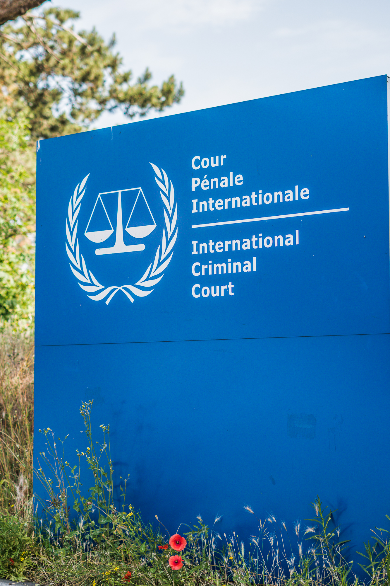

::: page-wrapper
::: columns
::: {.column width="50%"}
::: sidebar

:::
:::

::: {.column width="50%"}
::: main-column
Welcome! I am a political science doctoral candidate, studying International Relations at [the University of Texas at Dallas](https://www.utdallas.edu/fact-sheets/epps/phd-political-science/). My research topics are Conflict, Human Rights, and International Law. Among other methods, I employ computational tools to leverage large text data to answer my research questions.

My human rights scholarship focuses broadly on the prevention of torture and inhuman and degrading behavior or punishment. I study domestic actors and international mechanisms seeking to improve compliance with international human rights law, and how they interact with governments that have ratified the United Nations Convention Against Torture (CAT), its Optional Protocol (OPCAT), and the European Convention on Human Rights. My research further assesses the roles International Courts and the UN Treaty Bodies can play in promoting improved human rights compliance.

My conflict research focuses on conflict processes and political violence, specifically, which factors mobilize individuals to participate in political violence and how this violence affects communities in the aftermath. I further assess drivers of political violence and under which conditions governments increase their civilian victimization, or show restraint.

My dissertation focuses on three distinct dynamics within OPCAT ratifying countries. In my first paper, I assess the decision-making rationales of why countries create National Prevention Mechanisms (NPMs) in accordance with the OPCAT treaty provisions and how they determine their NPMs' setup. In my second paper, I assess whether frequent NPM monitoring and reporting can improve human rights compliance in ratifying countries. My third paper examines how shifts in domestic priorities and administrative changes influence the independence and operations of existing NPMs.

::: contact-section
Get in touch: <a href="mailto:dagmar.heintze@utdallas.edu">dagmar.heintze\@utdallas.edu</a> \| [Twitter](https://twitter.com/DagmarHeintze) \| [Bluesky Social](https://bsky.app/profile/dagmarheintze.bsky.social)
:::
:::
:::
:::
:::

:::
